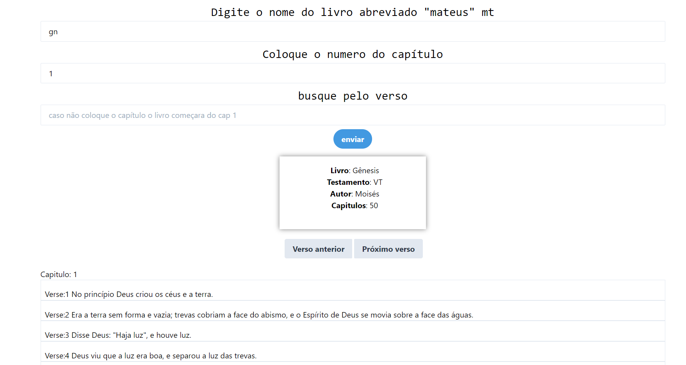
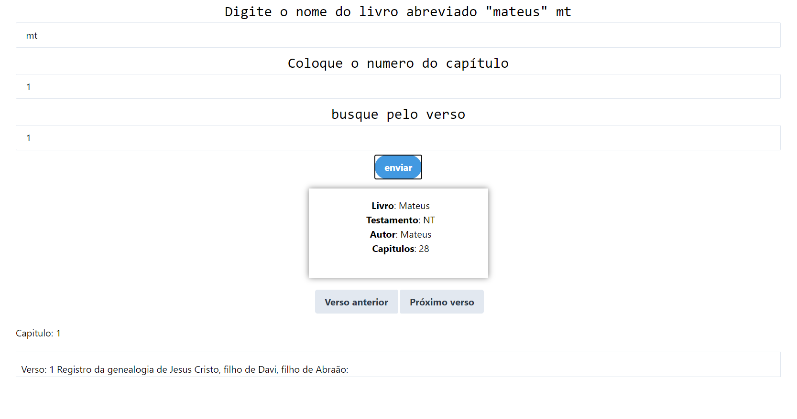

# App  Biblia Online

## Sobre o projeto

Esse projeto foi realizado como um desafio pessoal, eu sempre quis aprender mais sobre a palavra de Deus e não me encorajava em ver todas aquelas páginas e também não queria baixar um app no celular por conta das propagandas , então pensei em fazer um app web onde eu iria testar meus conhecimentos em HTML5 e JavaScript e aprender a usar o TailwindCss. Não fiz nenhum tipo de testes mais afundo pode haver alguns bugs, percebi que depois de muitas requisições em periodo curto de tempo a api entra em conflito, quando isso ocorrer esperar alguns segundos e depois volte a realizar a busca, caso seje um DEV  e quer utilizar a api vou deixar o link mais abaixo.

> Usei esta Api pública:  [ABíbliaDigital | RESTful API da Bíblia (bibleapi.co)](https://bibleapi.co/)

> Os endpoints são bem documentados e fáceis de usar.

### Busca por nome do Livro e capitulo

### Busca por nome do livro, capitulo e verso

## Autor

Gustavo Lima

>Site do meu app web 
https://gustavoguke.github.io/app-biblia.io/)